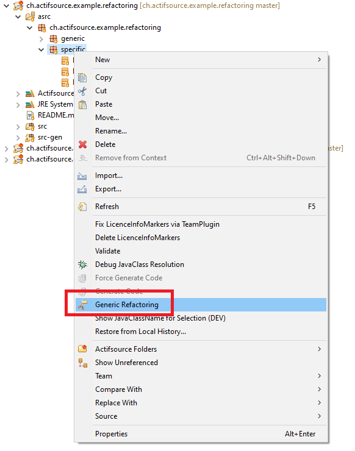
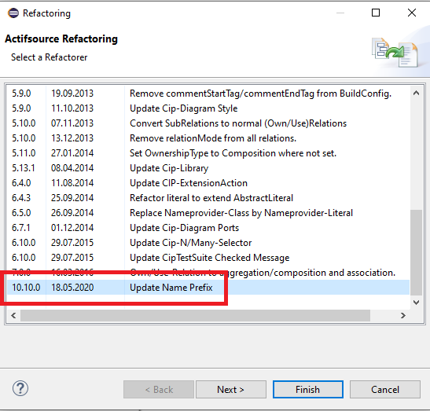

# Model Refactoring
In this project we will show how to refactor a model.

## Requirements
Actifsource  Workbench Community Edition

## License
[http://www.actifsource.com/company/license](http://www.actifsource.com/company/license)
